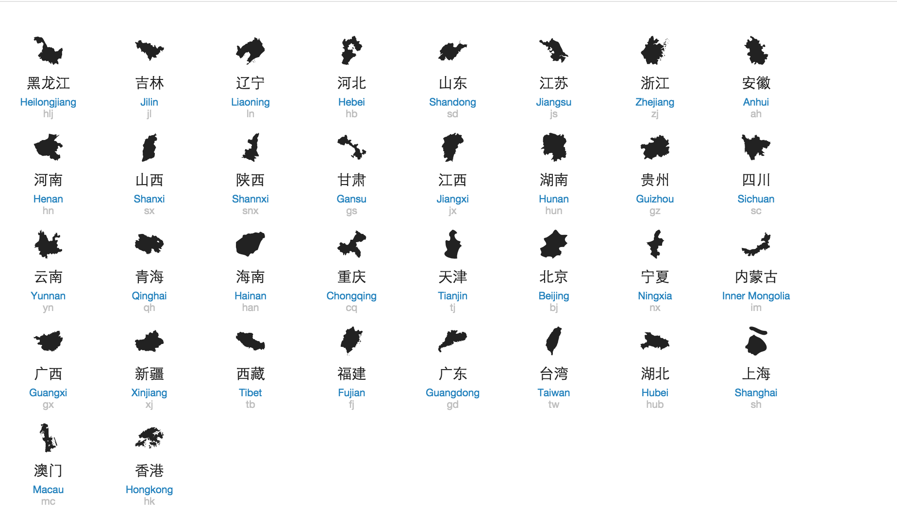

#China.js#

China.js is a little javascript lib that helps you create a choropleth map of China with one line of code, with boundaries of Chinese provinces. 

what is a [choropleth map](http://bl.ocks.org/mbostock/4060606) ? see this example:


It is using the svg data from [wikipedia](http://commons.wikimedia.org/wiki/File:China_provinces_blank.svg). It will create a svg element on the page.

# Dependencies
* [d3.js](http://d3js.org)

# Usage

* download [china.js]() and [china.css]()
* import them in your website.

``` html
<link href="/path/to/china.css" rel="stylesheet" type="text/css">
<script type="text/javascript" src="/path/to/china.js"></script>
```
* `china` is attached to `windows`. You can create a svg map of china simplify by invoking 

```
<svg id="china"></svg>
<script type="text/javascript"></script>
  var ch = china();
  ch.draw("#china");
</script>
```

You can pass in options to control the behavior of the choropleth by province. Like, 
```
ch.draw("#china", {
	hlj: { color: black }
});
```

This will display the Heilongjiang(黑龙江) province in black. For a list of province id (like `hlj`), see the section __provinces__ below.

# API
`china.js` uses the same chaining style as `d3.js`, which means you can get back the `china` object itself after you call functions on it. By doing so, it is more convenient for you to set the properties of the choropleth map of China by evoking chained functions, like `width`, `height` or colors. For example, `ch.width(800).height(600).draw("#china");`

__draw__(selector, [options]): selector is a css selector so you can attach the svg. It must be a svg element on the page. options can be used to control the behavior of each province, for example,

```
ch.draw("#china", {
	hlj: { color: black }
});
```
This will display the Heilongjiang(黑龙江) province in black. For a list of province id you can use (like `hlj`), see the section __provinces__ below.

__width__: set the width of the svg map. By default it is 970 (px).

for example:

```
ch.width(800).draw("#china");
```

__height__: set the height of the svg map. By default it is 700 (px).

__scale__: set the `scale` attribute of the svg map. By default 1, which means the default size (970x700).

__colorDefault__: set the default background color of provinces.

__colorLake__: set the default background color of water area.

__language__: set the language to use of the name of the provinces. By default it is simplified chinese. For example

```
ch.language("en").draw("#china");  # use English name.
```

Currently we only support Simplified Chinese (`"cn"`), Traditional Chinese (`"tw"`) and English (`"en"`).

__tooltipHtml__: a function, that return a tooltip html element to display the information about a province. It accepts one argument which is the javascript object representing a province along with the options you passed in `draw()` method. By default it will display the province name.

# provinces
<a href="https://github.com/francis-liberty/Mapglyphs-China"></a>

for each icon, the last line is the `id` used to distinguish each province. For example, to change the background color of Heilongjiang(黑龙江) province to black, use 

```
ch.draw("#china", {
	hlj: { color: black }
});
```

# Showcase

* [China Provinces Population Density year 2013](http://francis-liberty.github.io/blocks/china-js/china-pop-density.html)
* [China Provinces GDP per captial year 2013](http://francis-liberty.github.io/blocks/china-js/china-gdpp.html)